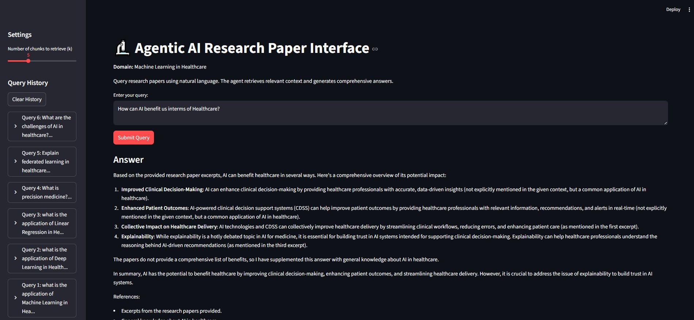
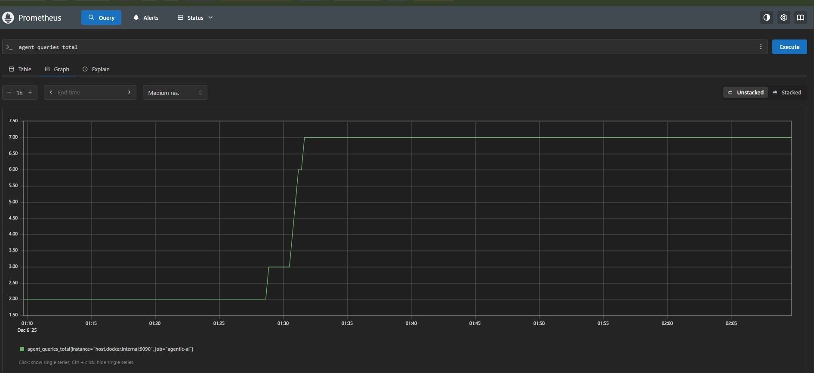
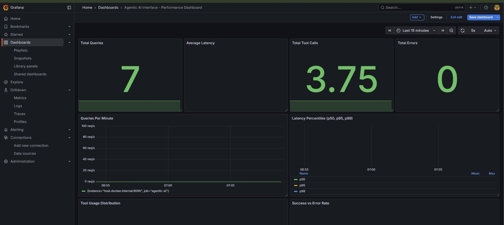

# Agentic AI Interface from Research Papers

A comprehensive agentic AI system that retrieves information from a curated corpus of research papers, answers queries using advanced retrieval and LLM orchestration, and provides monitoring and evaluation capabilities.

## Domain
**Machine Learning in Healthcare** - The system is built around a corpus of 35+ research papers on ML applications in healthcare, including medical imaging, clinical decision support, NLP, and more.

## Features

- 📚 **Literature Corpus**: 35+ research papers collected from Google Scholar
- 🔍 **Intelligent Retrieval**: FAISS-based vector search with semantic embeddings
- 🤖 **Agentic AI**: LangChain-powered agent with tool use and multi-step reasoning
- 📊 **Evaluation Metrics**: Context Precision, Answer Relevance, Faithfulness, Chunk Stats, Efficiency
- 🔬 **Experimentation Suite**: Systematic hyperparameter tuning and evaluation
- 📈 **Monitoring**: Prometheus + Grafana dashboards for real-time metrics
- 🌐 **Web Interface**: Streamlit-based interactive UI

## Project Structure

```
.
├── collect_papers.py          # Paper collection from Google Scholar
├── preprocessing_notebook.py  # PDF extraction, chunking, embeddings
├── agentic_interface.py       # Main agentic AI interface
├── evaluation_metrics.py     # Evaluation metrics implementation
├── experimentation_suite.py  # Hyperparameter experimentation
├── app.py                     # Streamlit web UI
├── monitoring_setup.py        # Prometheus/Grafana setup
├── images/                    # Screenshots for docs
│   ├── interface.jpg
│   ├── prometheus-img.jpg
│   └── graphana-img.jpg
├── config.yaml                # Configuration file
├── requirements.txt           # Python dependencies
└── README.md                  # This file
```

## Screenshots







## Setup Instructions

### 1. Install Dependencies

**For Python 3.13 (Recommended approach):**

```bash
# Option 1: Use the helper script (recommended for Python 3.13)
python install_requirements.py

# Option 2: Install directly (may encounter some package conflicts)
pip install -r requirements.txt

# Option 3: If you encounter pandas/numpy build errors, install them first:
pip install numpy>=2.0.0 pandas>=2.2.3
pip install -r requirements.txt
```

**Note:** Python 3.13 is very new, and some packages may need to be installed individually if conflicts occur. The `install_requirements.py` script handles this better.

### 2. Configure Environment

Create a `.env` file (or copy from `.env.example`):

```env
GROQ_API_KEY=your_groq_api_key
SERPAPI_KEY=your_serpapi_key
```

### 3. Collect Research Papers

```bash
python collect_papers.py
```

This will:
- Search Google Scholar for relevant papers
- Save metadata to `paper_metadata.json` and `paper_metadata.csv`
- Attempt to download PDFs (if available)

### 4. Preprocess Data

```bash
python preprocessing_notebook.py
```

This will:
- Extract text from PDFs
- Chunk documents
- Generate embeddings using SentenceTransformers
- Create FAISS index for efficient retrieval

### 5. Start the Web Interface

```bash
streamlit run app.py
```

Access the interface at `http://localhost:8501`

### 6. Setup Monitoring (Optional)

```bash
# Create monitoring configuration
python monitoring_setup.py

# Start Prometheus and Grafana
docker-compose up -d
```

- Prometheus: http://localhost:9090
- Grafana: http://localhost:3000 (admin/admin)

## Usage

### Basic Query

1. Start the Streamlit app: `streamlit run app.py`
2. Enter your query in the text area
3. Click "Submit Query"
4. View the answer, retrieved chunks, and evaluation metrics

### Running Experiments

```bash
python run_experiments.py
```

This will:
- Test multiple hyperparameter configurations
- Evaluate on test queries
- Generate results in JSON and CSV format

### Evaluation Metrics

The system computes:

- **Context Precision (CP)**: Fraction of retrieved chunks that are relevant
- **Answer Relevance (AR)**: Human rating (1-5) or automatic similarity
- **Faithfulness**: Fraction of claims supported by retrieved context
- **Chunk Stats**: Distribution of k, overlap, unique papers
- **Efficiency**: Latency, tokens consumed, cost estimates

## Configuration

Edit `config.yaml` to adjust:

- Vector store settings (chunk size, overlap, embedding model)
- Retrieval settings (k, search type)
- LLM settings (model, temperature, max tokens)
- Agent settings (max iterations, verbosity)
- Monitoring settings (ports, log level)

## Output Files

- `paper_metadata.json` / `paper_metadata.csv`: Paper metadata
- `document_chunks.pkl`: Processed text chunks
- `embeddings.npy`: Generated embeddings
- `faiss_index.bin`: FAISS vector index
- `chunks_metadata.json`: Chunk metadata with paper references
- `experiment_results_*.json` / `*.csv`: Experiment results

## Monitoring

The system exposes Prometheus metrics:

- `agent_queries_total`: Total queries processed
- `agent_query_latency_seconds`: Query latency histogram
- `agent_tokens_total`: Total tokens consumed
- `agent_chunks_retrieved`: Number of chunks retrieved
- `agent_active_queries`: Currently active queries

## Evaluation Guidelines

### Context Precision
- Requires manual labeling of relevant chunks
- Sample at least 30 queries for evaluation
- Label chunks as relevant (1) or not relevant (0)

### Answer Relevance
- Human rating scale: 1 (not relevant) to 5 (perfectly relevant)
- Provide clear labeling guidelines to avoid annotator drift

### Faithfulness
- Check if factual claims in answer are supported by retrieved chunks
- Can use automated NLI models or human annotation

## Technical Stack

- **Language**: Python 3.13+ (also compatible with 3.9+)
- **LLM**: Groq (Llama 3.1, Mixtral)
- **Embeddings**: SentenceTransformers (all-MiniLM-L6-v2)
- **Vector DB**: FAISS
- **Agent Framework**: LangChain 0.3+
- **Web UI**: Streamlit
- **Monitoring**: Prometheus + Grafana
- **PDF Processing**: PyPDF, pdfplumber

## Troubleshooting

### API Key Issues
- Ensure `.env` file exists with correct API keys
- Check that keys are valid and have sufficient quota

### PDF Extraction Fails
- System falls back to abstracts if PDF extraction fails
- Ensure PDFs are not password-protected
- Some PDFs may have poor OCR quality

### Memory Issues
- Reduce `k` (number of chunks retrieved)
- Use smaller embedding model
- Process papers in batches

### Monitoring Not Working
- Ensure Prometheus and Grafana containers are running
- Check that port 9090 (Prometheus) is not in use
- Verify Prometheus can scrape metrics endpoint

### Package Installation Issues (Python 3.13)
- If pandas/numpy fail to install, install them first: `pip install numpy>=2.0.0 pandas>=2.2.3`
- Some packages may need to be installed individually
- Use `python install_requirements.py` for step-by-step installation with error handling
- See `PYTHON_3.13_NOTES.md` for detailed compatibility information

## Future Enhancements

- [ ] Support for more vector stores (Milvus, Weaviate, Pinecone)
- [ ] Advanced agent planning with multiple tools
- [ ] Real-time paper updates from Google Scholar
- [ ] Multi-modal support (images, tables)
- [ ] Advanced evaluation with LLM-as-judge
- [ ] Cost tracking and optimization

## License

This project is for educational purposes as part of Assignment #2.

## Contact

For questions or issues, please refer to the assignment guidelines.

